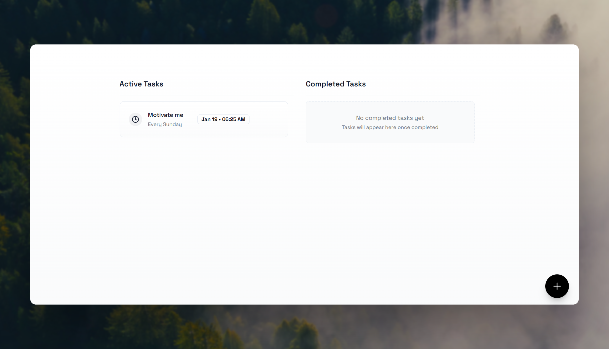
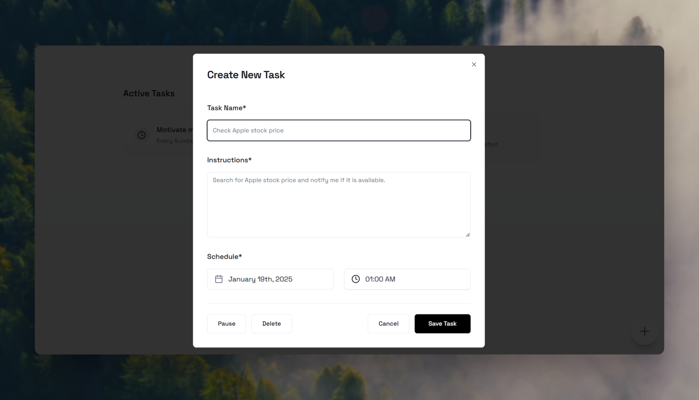

<div align="center">

# OpenTask

### 🎯 The Open-source Alternative to OpenAI ChatGPT Tasks

[Features](#features) • [Demo](#demo) • [Installation](#installation) • [Contributing](#contributing)




</div>

## 🌟 What is OpenTask?

OpenTask is a modern, AI-powered task management platform that brings the intelligence of ChatGPT to your daily workflow. Built with React and modern web technologies, it helps teams and individuals organize, track, and complete tasks more efficiently.

## ✨ Features



### Core Features

- **🤖 AI-Powered Task Management**
  - Smart task categorization
  - Intelligent due date suggestions
  - Natural language task creation

- **🔄 Real-time Synchronization**
  - Instant updates across devices
  - Offline support with automatic sync
  - Conflict resolution

- **📱 Cross-Platform Support**
  - Responsive web interface
  - Progressive Web App (PWA)
  - Native-like experience

### Advanced Capabilities

- **🎯 Task Organization**
  - Custom workspaces and projects
  - Tags and labels
  - Priority levels
  - Due date tracking

- **👥 Collaboration**
  - Team workspaces
  - Task sharing
  - Comments and discussions
  - Activity timeline

## 🛠️ Tech Stack

- **Frontend**
  - React 18
  - TailwindCSS
  - Framer Motion
  - Lucide Icons

- **State Management**
  - Zustand
  - React Query

- **Development**
  - TypeScript
  - Vite
  - ESLint
  - Prettier

## 🚀 Getting Started

```bash
# Clone the repository
git clone https://github.com/yourusername/opentask.git

# Navigate to project directory
cd opentask

# Install dependencies
pnpm install

# Start development server
pnpm dev
```

## 📖 Documentation

Visit our [documentation site](https://docs.opentask.dev) for:
- Complete API reference
- Integration guides
- Best practices
- Examples and tutorials

## 🤝 Contributing

We love our contributors! Here's how you can help:

1. Fork the repository
2. Create your feature branch (`git checkout -b feature/AmazingFeature`)
3. Commit your changes (`git commit -m 'Add some AmazingFeature'`)
4. Push to the branch (`git push origin feature/AmazingFeature`)
5. Open a Pull Request

## 📜 License

OpenTask is MIT licensed. See [LICENSE](LICENSE) for details.

## 💖 Acknowledgments

- UI Components: [shadcn/ui](https://ui.shadcn.com)
- Icons: [Lucide](https://lucide.dev)
- Animation: [Framer Motion](https://framer.com/motion)
- IDE : Cursor , Bolt.new , Versel V0

---
